# Raahi 2.0 UML Freeze v1.0

**Frozen:** 2026-09-05
**Companion:** `RAAHI_2_0_ARCHITECTURE_FREEZE_V1.md`
**Purpose:** Versioned target-domain diagrams. Current legacy tables/RPCs may differ until migrated.

## 1. System context

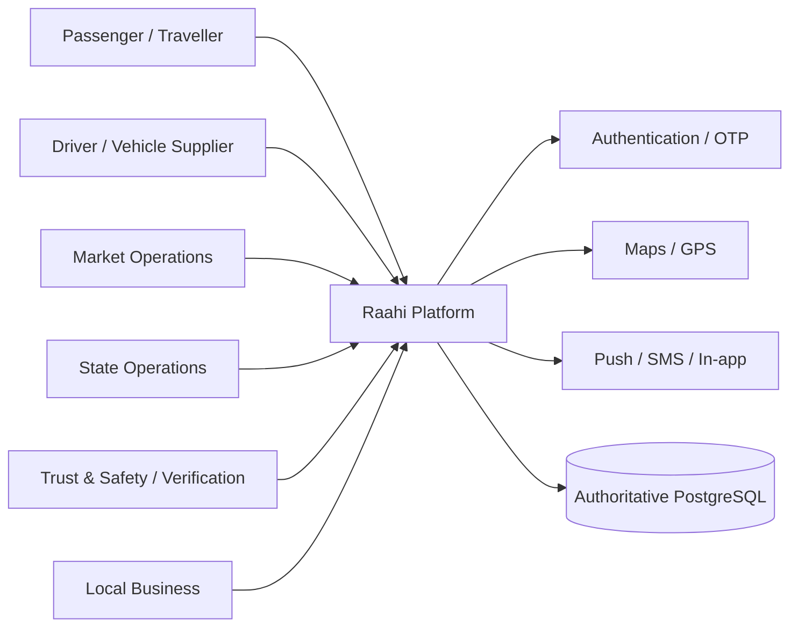

Ownership rule: Humans express intent; Raahi defines rules; System executes; Admin handles exceptions.

## 2. Geographic and Product model
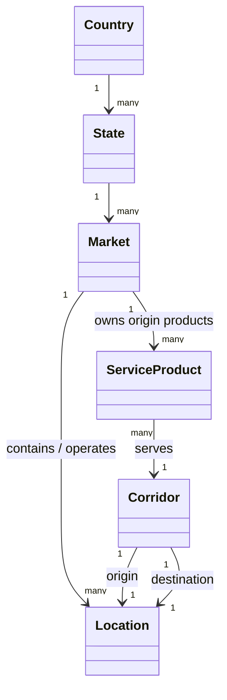

A Market may be publicly branded as a city/town while remaining an operational boundary internally. A Location may be a town, station, airport or other mobility node.

## 3. Identity, Driver and operating-market model

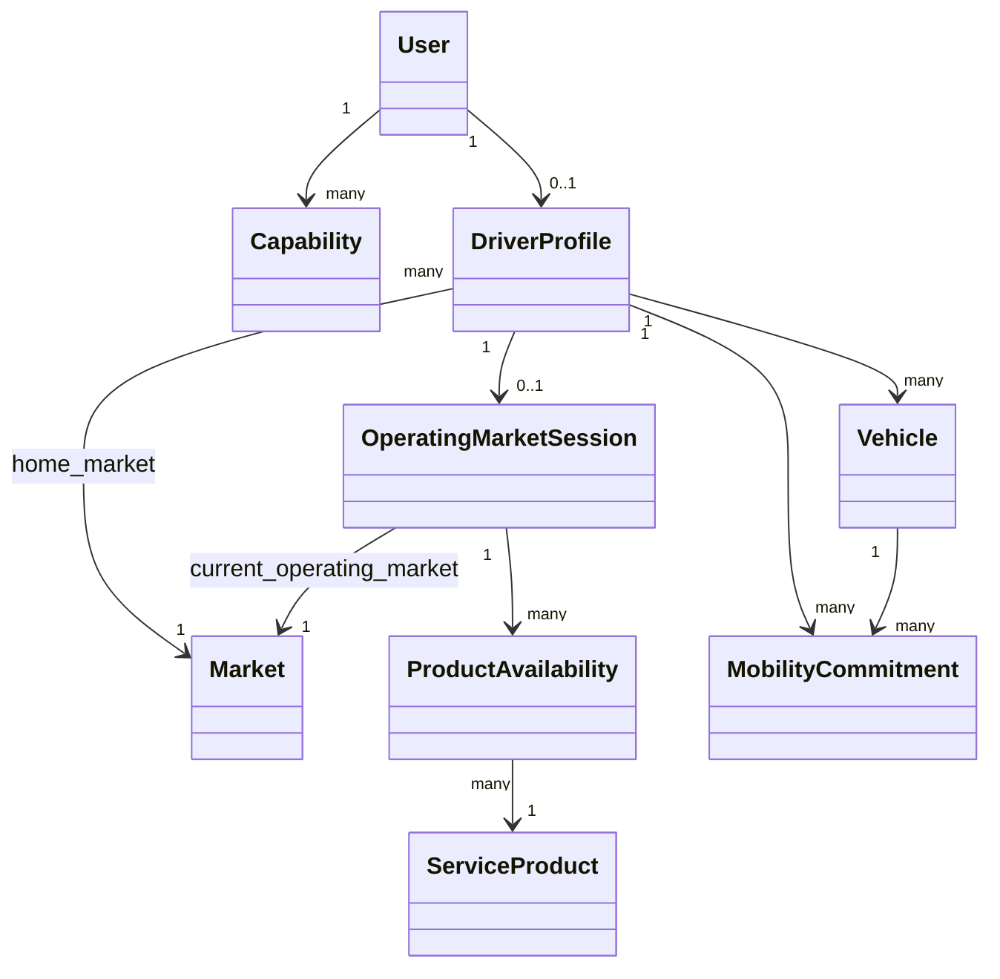

Eligibility is based on verified Driver + eligible Vehicle + Current Operating Market + explicit Product availability + no conflict. Home Market does not grant FIFO priority.

## 4. Core marketplace domain

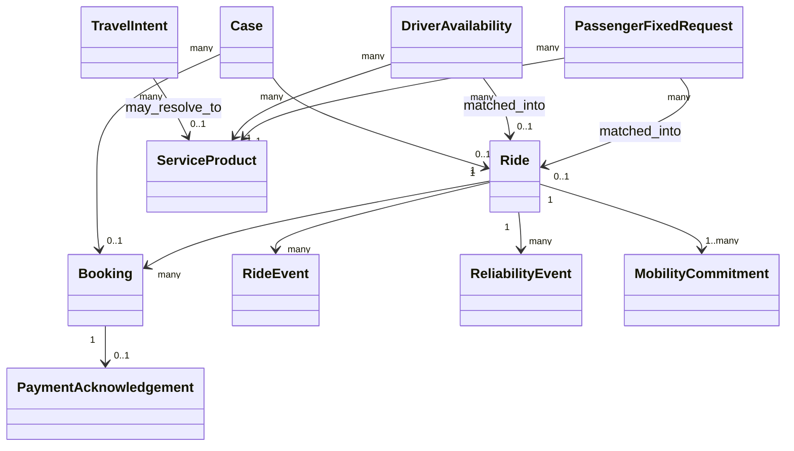

Travel Intent is not a Booking. Queue requests are not Rides until matching creates a commitment.

## 5. Fixed One Way sequence

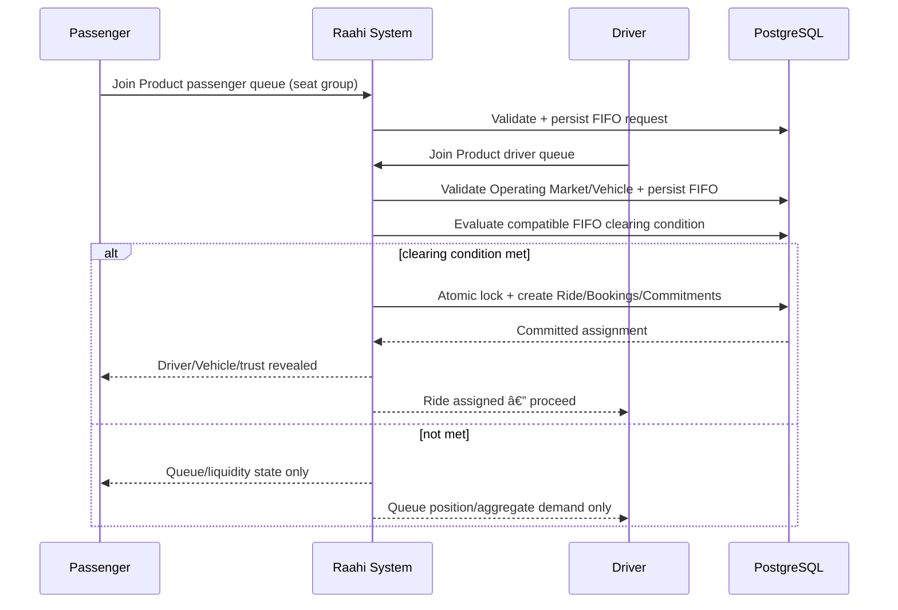

No active car exists merely because the first Driver joined. No pre-match Passenger/Driver identity browsing exists.

## 6. Driver Operating Market state

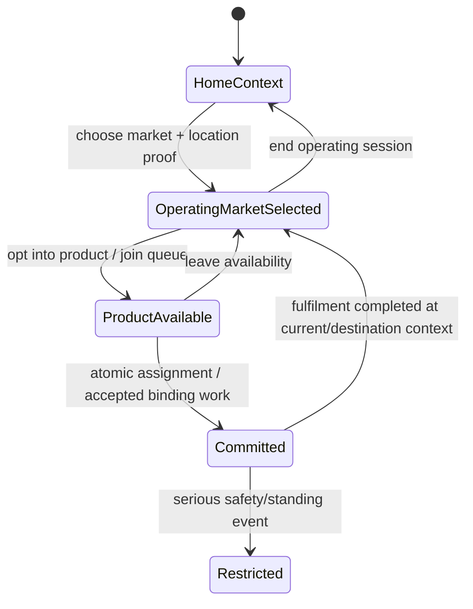

Changing Operating Market exits incompatible uncommitted availability and never carries FIFO position.
## 7. Fixed Round Trip lifecycle

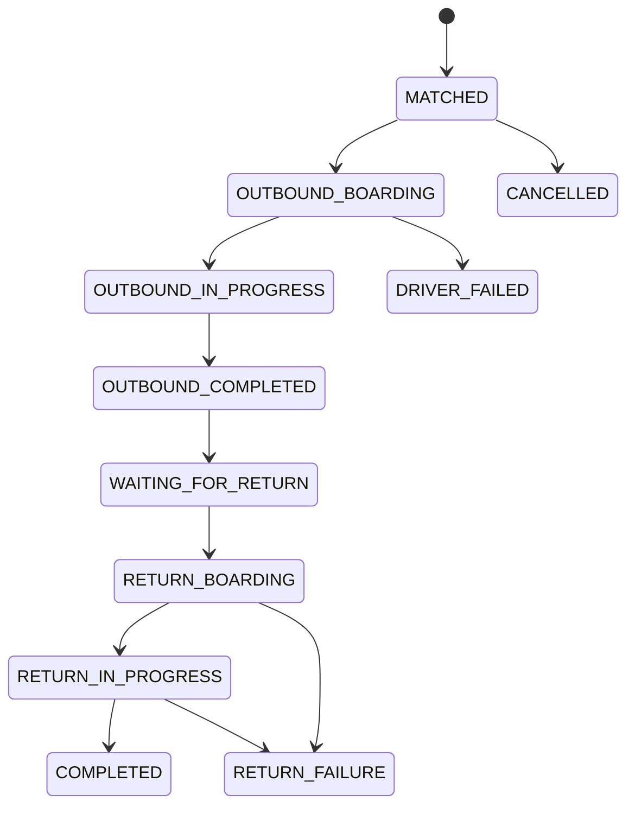

The same Driver, Vehicle and booked return capacity remain committed through the full window.

## 8. Outstation quote/accept sequence

```mermaid
sequenceDiagram
    participant P as Passenger
    participant S as Raahi System
    participant D as Eligible Drivers
    participant DB as PostgreSQL
    P->>S: Create Outstation request
    S->>DB: Persist request + resolve eligible audience
    S-->>D: Private lead
    D->>S: Quote / Ignore
    S->>DB: Version quote privately
    S-->>P: Show valid quotes + trust projection
    P->>S: Accept selected quote revision
    S->>DB: Atomic recheck expiry/revision/eligibility/conflicts
    alt valid
        DB-->>S: Accept one + close others + create commitment
        S-->>P: Driver selected / contact unlocked
        S-->>D: Booking confirmed
    else stale/conflict
        S-->>P: Refresh current state; no partial acceptance
    end
```

## 9. Raahi Trip lifecycle

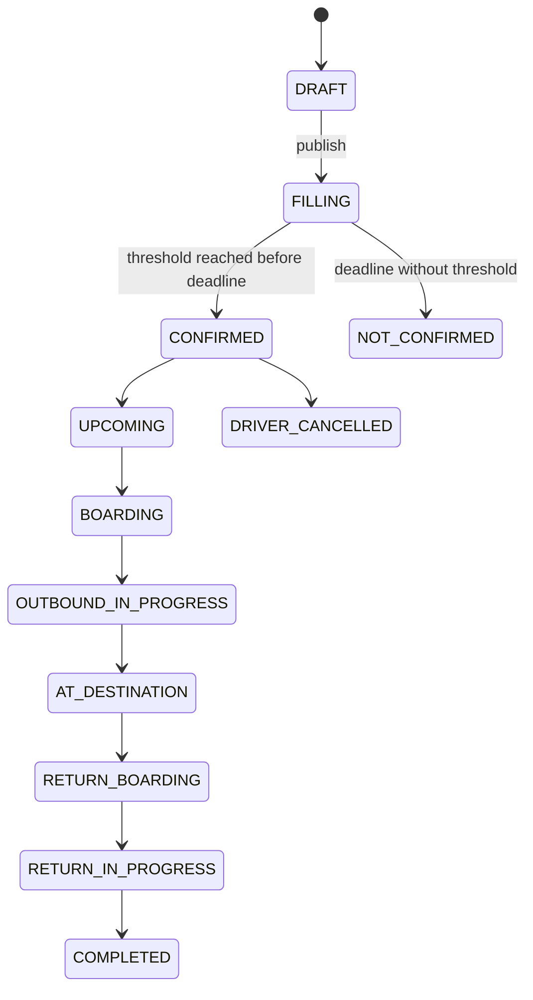

Threshold is a one-time confirmation trigger. Once confirmed, later passenger cancellations do not silently unconfirm the Trip.

## 10. Payment and Case states

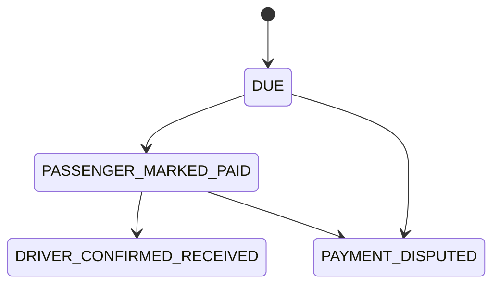

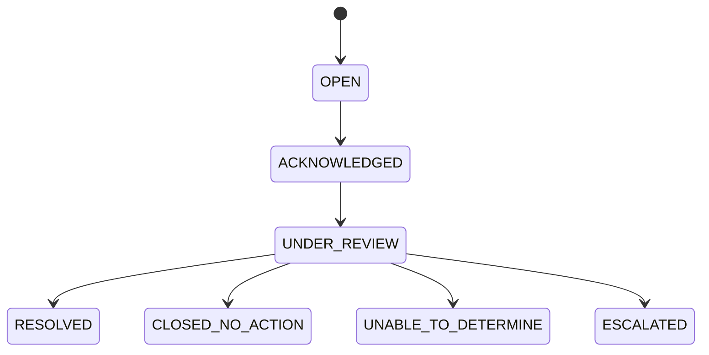

Ride state, Payment state and Case state remain separate authoritative objects.
## 11. Admin permission and scope model

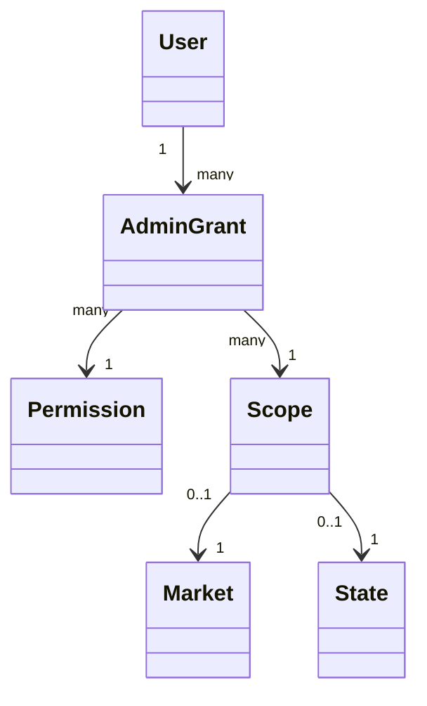

Examples: Market Operations@Gomoh, Market Operations@Dhanbad, Verification@Jharkhand, TrustSafety@Jharkhand, PlatformAdmin@India.

Admin access is purpose-limited and audited. Market Operations cannot gain unrelated Platform authority through UI navigation.

## 12. Market lifecycle and route opportunity

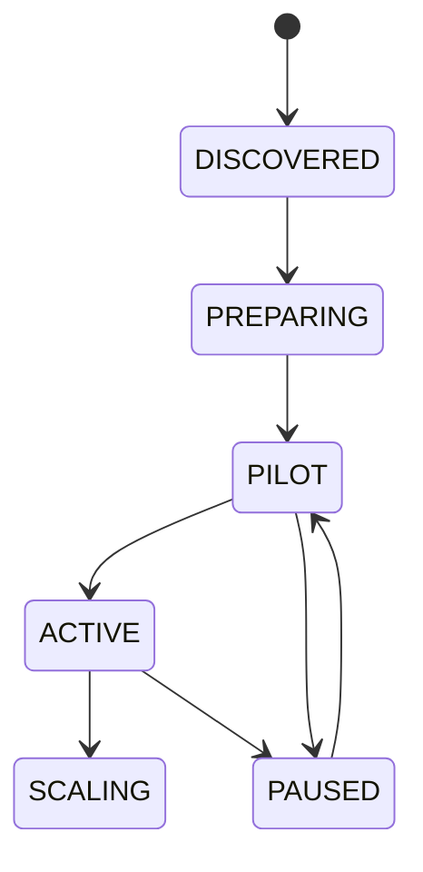

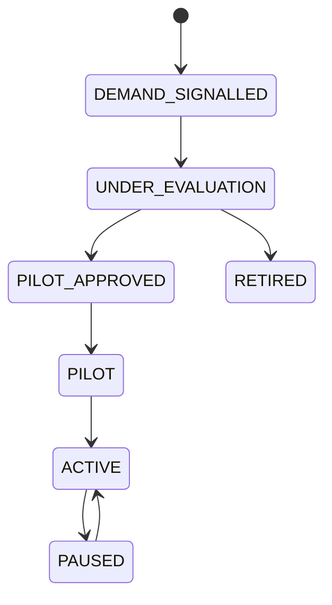

The System may surface opportunity; authorized Operations chooses whether to pilot/activate.

## 13. Cross-service commitment guard

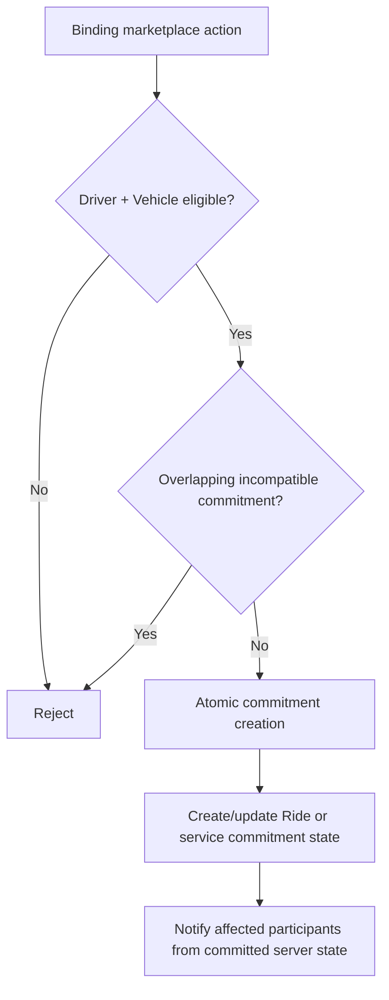

Exactly one commitment authority must be consulted by Fixed, Round Trip, Outstation, Carpool and Raahi Trips.

## 14. Metrics tree

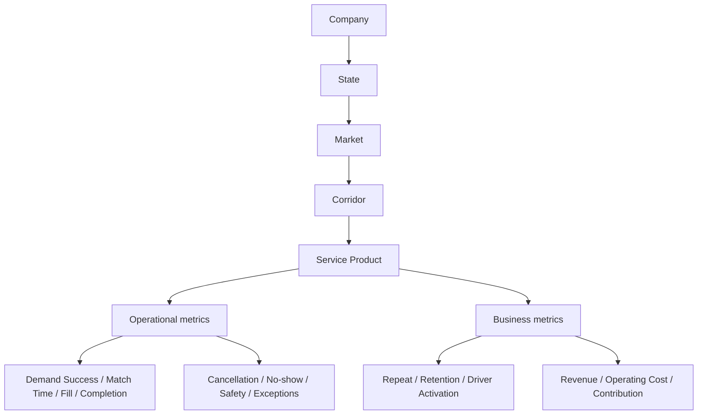

Company north-star candidates are Successful Journeys per Active Market per Week, Demand Success Rate, Repeat Journey Rate and Time to Liquidity.

## 15. Diagram governance

These diagrams are frozen target behavior. A material change requires an explicit Decision/ADR and corresponding acceptance-test impact before implementation.

Legacy tables such as current `trips`, `trip_seats`, `seat_requests`, `driver_queue` and exclusive `profiles.role` remain implementation evidence until deliberately superseded; they do not redefine this target UML.
