# Raahi Mini — Master Architecture Sheet

**Status:** Canonical living architecture reference  
**Authority:** This document defines intended system behaviour. Code, migrations, UI and operational procedures must conform to it.  
**Governance:** Every architecture-affecting change must update this sheet in the same PR. If implementation and this sheet disagree, stop and reconcile before proceeding.

## 1. Product Scope

Raahi Mini is a shared-seat micro-transit coordination system. Public users may browse locations, routes, active cars, seat availability, pickup progress and ETA anonymously. Passenger authentication is required only when the user finally requests seats. Google establishes the account identity; a Supabase Auth-confirmed phone must be enrolled before the first booking. Driver and admin functions always require authenticated protected access.

Passengers pay the driver directly only after physically meeting the driver. Raahi does not collect fare in V1. Reliability is enforced through verified accounts, behaviour events, no-show/cancellation history, admin restrictions and later policy penalties.

Drivers are not permanently assigned to routes. A driver chooses their current location, sees only routes departing from that location, selects one route and joins that route's FIFO queue. After trip completion, the destination is suggested as the driver's next current location.

## 2. Architectural Principles

1. PostgreSQL is authoritative state.
2. All business transitions occur through canonical RPCs; UI must not directly mutate operational tables.
3. Supabase Realtime is invalidation/refetch only, never an independent state authority.
4. One public production command per business transition.
5. Driver queue owns route FIFO and activation order.
6. Trips own journey lifecycle.
7. Seat requests own passenger demand lifecycle.
8. `trip_seats` is the authoritative physical seat ledger.
9. Admin exception actions must preserve the same invariants as normal flows.
10. Public projections expose only bookable/appropriate state.
11. Passenger browsing stays public; driver and admin access use dedicated authentication entry paths.

## 3. Domain Model

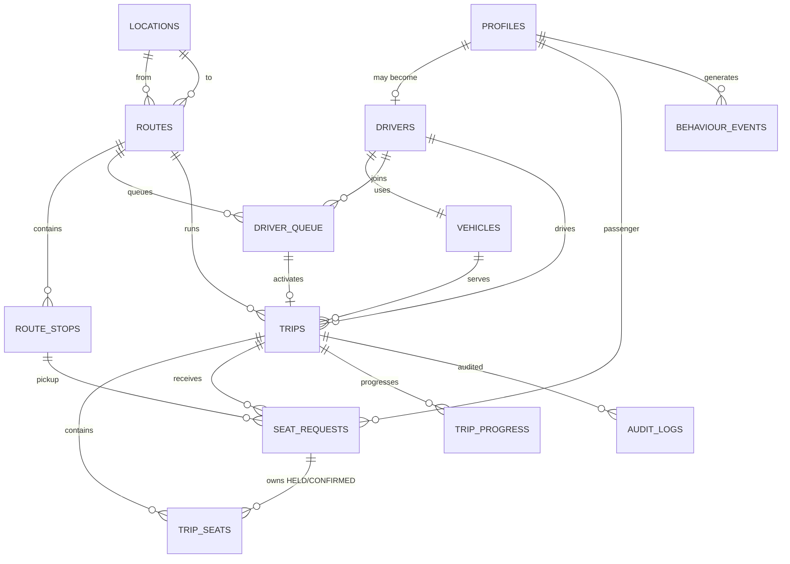

### Core ownership rules

- `profiles`: identity, role, restriction state.
- `drivers`: driver-specific operational record; no permanent route ownership.
- `vehicles`: real vehicle and seat capacity (4/6/8).
- `routes`: directed route from one location to another.
- `route_stops`: fixed ordered pickup path.
- `driver_queue`: driver's route choice for a specific journey and FIFO position.
- `trips`: active/started/completed journey instance.
- `seat_requests`: passenger request lifecycle.
- `trip_seats`: concrete seat ownership/state ledger.
- `trip_progress`: ordered stop progression.
- `behaviour_events`: cancellation/no-show/reliability evidence.
- `audit_logs`: immutable operational audit trail.

## 4. Passenger State Machine

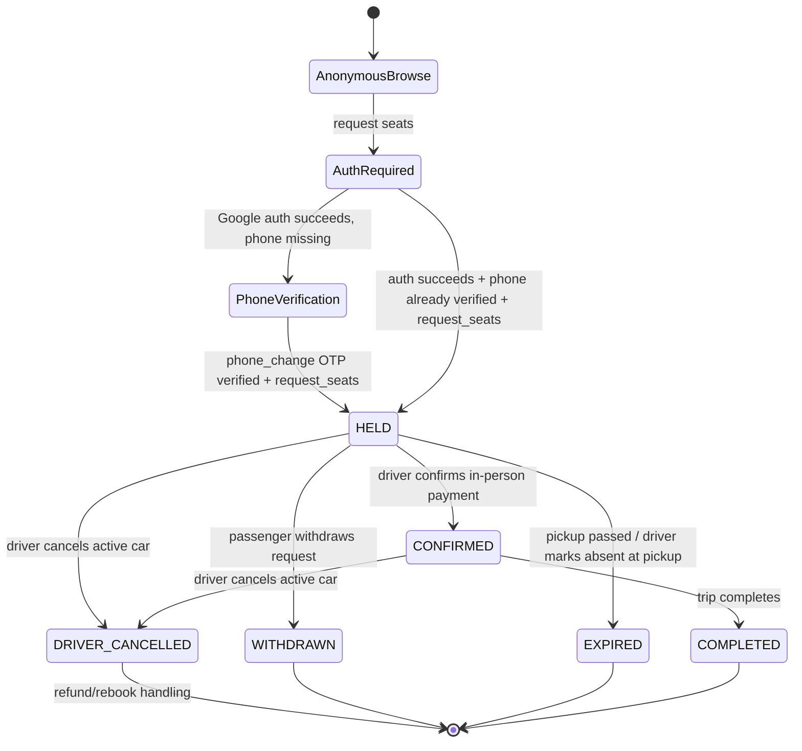

### Passenger rules

- Anonymous browsing is allowed.
- Authentication is required only at final seat request.
- Google OAuth is the primary account-creation/sign-in path for passenger booking.
- A Supabase Auth phone with non-null `phone_confirmed_at` is required before `request_seats`; the RPC enforces this invariant.
- Adding or changing a phone uses authenticated `updateUser` plus `verifyOtp(type='phone_change')`.
- Removing a phone is allowed only while another confirmed sign-in identity remains; booking is disabled until a replacement phone is verified.
- Phone OTP login, when exposed, must set `shouldCreateUser=false` so unknown numbers cannot create parallel accounts.
- A passenger may not hold/confirm multiple active requests on the same trip.
- Multi-seat request is all-or-nothing.
- Passenger pays only after physically meeting driver.
- Confirmed seat means driver acknowledged payment in person.
- Passenger cannot be marked absent before the car has reached the selected pickup stop.
- Driver cancellation after confirmation transitions request to `DRIVER_CANCELLED`, preserving passenger visibility and refund follow-up.

## 5. Driver Authentication and Lifecycle

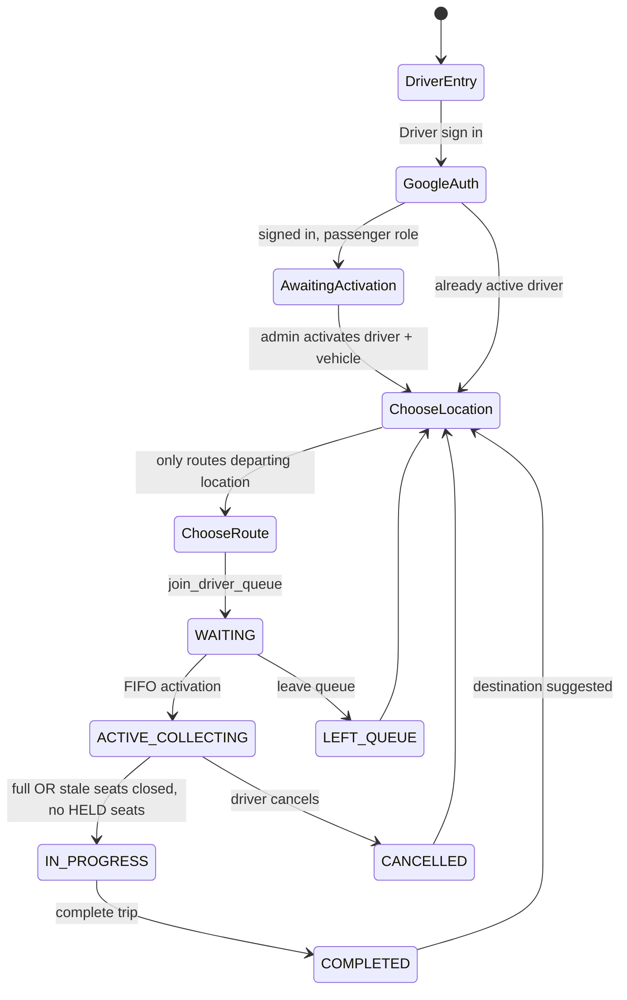

### Driver authentication rule

Passenger browsing must not be polluted by a global login requirement. Therefore the account menu exposes a distinct **Driver sign in** entry when unauthenticated. It launches Google OAuth and returns to `/driver-login`.

A first-time signed-in driver candidate still has the default `passenger` role and sees an "awaiting activation" state. Admin then verifies the known person, assigns/updates the vehicle and promotes the profile to `driver`. On subsequent sign-in, an active driver is routed to `/driver-route-selection`.

Client metadata can never self-promote a user into `driver` or `admin`.

### Driver route rule

A driver belongs to Raahi and a vehicle, not to a route. `driver_queue.route_id` is the authoritative route selection for that journey. The server validates `route.from_location_id == declared_current_location_id` when joining the queue. No GPS dependency is required.

## 6. FIFO and Active-Car State Machine

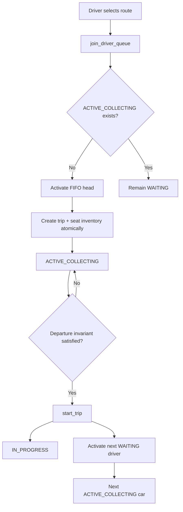

### FIFO invariants

- At most one `ACTIVE_COLLECTING` queue entry per route.
- At most one live queue entry (`WAITING` or `ACTIVE_COLLECTING`) per driver.
- Queue activation is serialized per route.
- Live queue rank is computed from current live entries, not historical `queue_position` alone.
- Starting one trip may activate the next collecting car for the same route while the first trip is `IN_PROGRESS`.

## 7. Trip Lifecycle

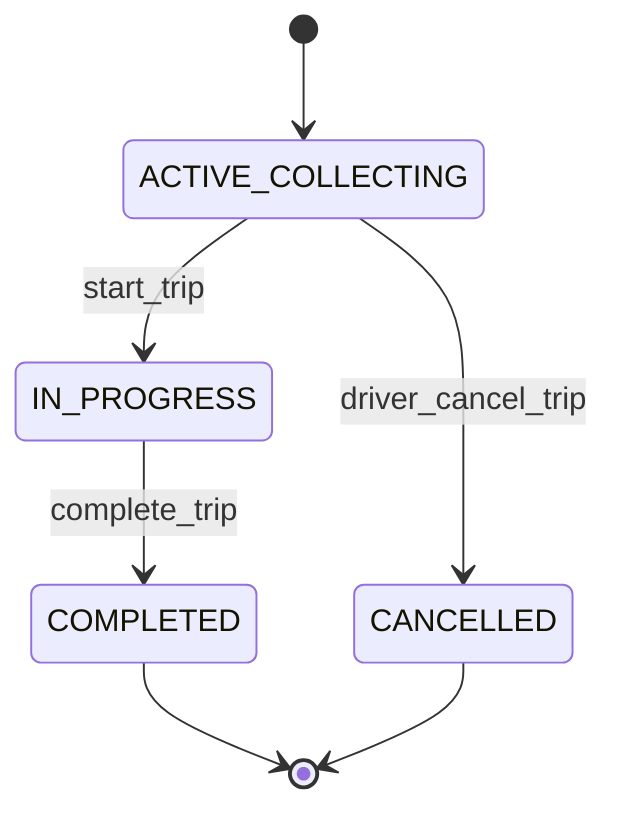

### Departure invariant

A trip may start only when `held_count = 0` and `confirmed_count + driver_closed_count = capacity`.

This means the car either has paying confirmed passengers or the driver intentionally closes remaining seats as stale/empty seats.

## 8. Seat Ledger State Machine

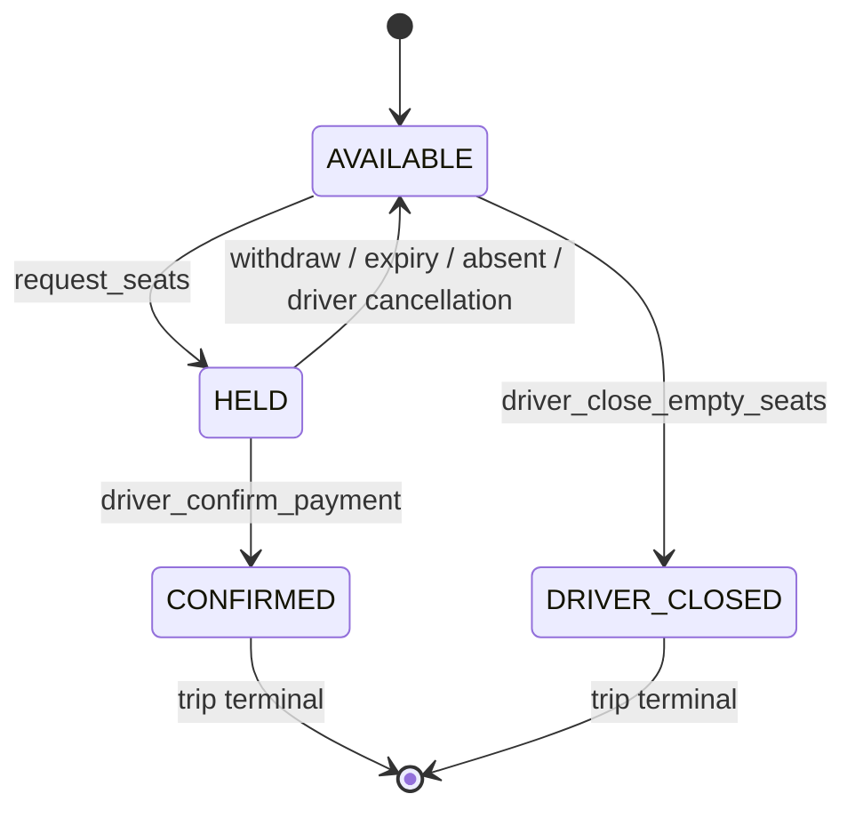

### Seat invariants

- `AVAILABLE` and `DRIVER_CLOSED` seats have `request_id IS NULL`.
- `HELD` and `CONFIRMED` seats have `request_id IS NOT NULL`.
- Every HELD request owns exactly `seat_count` HELD `trip_seats` rows.
- Every CONFIRMED request owns exactly `seat_count` CONFIRMED `trip_seats` rows.
- Trip counters are fast projections and must mirror the seat ledger.
- Cancellation/withdraw/expiry releases the exact seats owned by that request.

## 9. Fixed Stop Progression

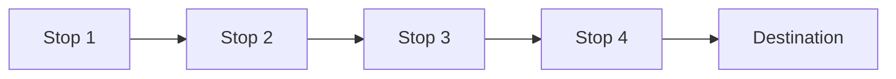

- Stops are deterministic and ordered.
- Driver cannot skip stops through RPC.
- Booking is allowed only for stops not already passed.
- Reaching a later stop expires HELD requests for earlier missed stops.
- Passenger absence may be recorded only when the car has reached that passenger's selected stop.
- Pilot timing assumption: Gomoh pickup cluster ~5 minutes total; Dhanbad pickup cluster ~15 minutes total.

## 10. Driver Cancellation / Passenger Recovery

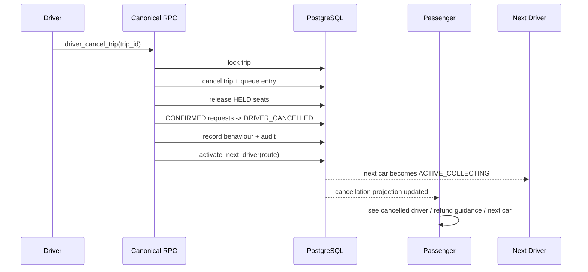

V1 financial rule: Raahi does not process refunds because fare is paid directly to the driver. The passenger receives driver contact/refund guidance and may report a refund problem for admin follow-up.

## 11. Passenger Booking Sequence

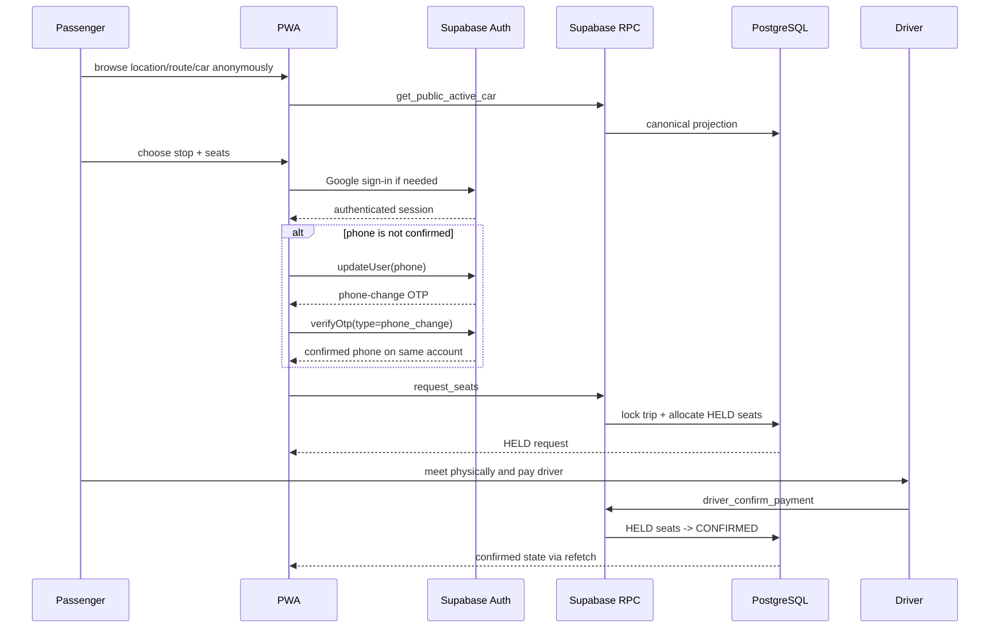

Google OAuth must exchange its PKCE authorization code exactly once in the browser completion boundary, establish the cookie-backed session, and then resume the pending seat request context rather than forcing the passenger to restart. If phone enrollment is still required, the saved request resumes after phone verification.

## 12. Driver Sign-in and Route Selection Sequence

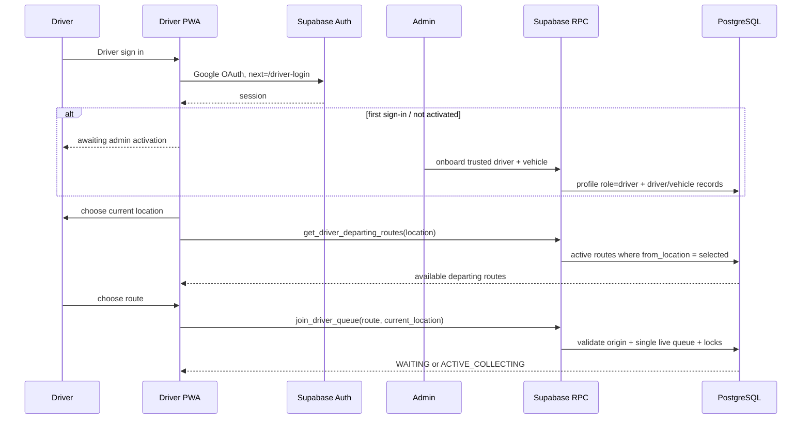

### Admin sign-in sequence

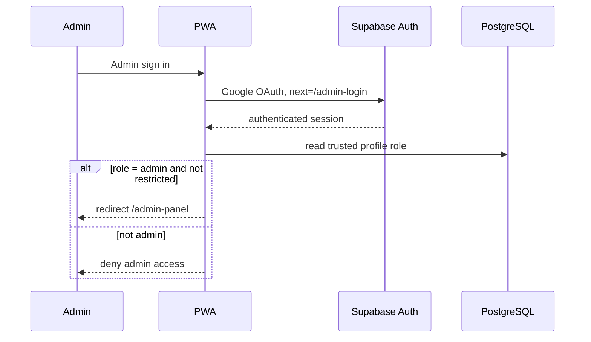

## 13. Canonical Command Surface

### Passenger commands
- `request_seats(trip_id, pickup_stop_id, seat_count)`
- `withdraw_seat_request(request_id)`
- `passenger_report_refund_problem(request_id)`

### Driver commands
- `join_driver_queue(route_id, current_location_id)`
- `leave_driver_queue(route_id)`
- `driver_confirm_payment(request_id)`
- `driver_mark_passenger_absent(request_id)`
- `driver_arrive_at_stop(trip_id, stop_id)` / canonical ordered progression helper
- `driver_close_empty_seats(trip_id)`
- `start_trip(trip_id)`
- `complete_trip(trip_id)`
- `driver_cancel_trip(trip_id)`

### Admin commands
- restrict/unrestrict user
- onboard/update trusted driver + vehicle
- deactivate driver safely
- queue reorder/remove functions
- operational exception functions only where invariants are preserved

### Internal-only helpers
Functions such as FIFO activation, audit recording, behaviour recording and seat-release helpers must not be executable by ordinary anonymous/authenticated clients unless explicitly intended.

## 14. Read Projections

### Public
- active locations
- routes for selected location
- only `ACTIVE_COLLECTING` car is publicly bookable/displayed as active car
- public active-car seat availability and stop progress

### Passenger-authenticated
- my active request, explicitly flagged active or completed
- passenger ride status, including completed-arrival state
- driver-cancelled request recovery projection

### Driver-authenticated
- driver home context
- departing routes for selected location
- live queue rank
- active car + passenger requests

### Admin-authenticated
- active trips
- behaviour events
- driver/vehicle management
- route queue state

## 15. Realtime Rule

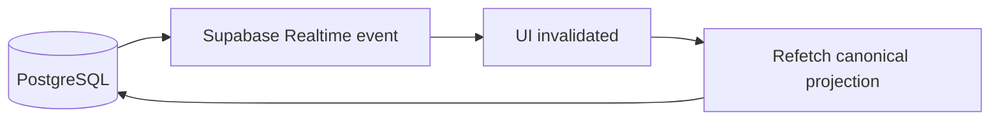

Realtime payloads are never treated as authoritative business state. They only trigger a canonical refetch.

## 16. Authentication and Roles

- New users default to passenger role.
- Anonymous passengers browse without authentication.
- Passenger auth is requested only at final seat-request action.
- Passenger accounts use Google as the primary identity and enroll a verified phone on the same Auth user.
- Supabase Auth `phone_confirmed_at`, not editable profile metadata, is the phone-verification authority.
- The canonical booking RPC rejects authenticated users without a confirmed phone.
- Unauthenticated drivers use a dedicated `Driver sign in` entry and `/driver-login` flow.
- Google OAuth returns driver candidates to `/driver-login`.
- First-time driver candidates remain passenger-role until trusted admin onboarding.
- Driver role is granted only through trusted admin onboarding after the user has signed in once.
- Active drivers are routed to `/driver-route-selection` after authentication.
- Unauthenticated admins use a dedicated `Admin sign in` entry and `/admin-login` flow.
- Google OAuth returns admin candidates to `/admin-login`; only an existing trusted `profiles.role='admin'` account is admitted to `/admin-panel`.
- Admin role is never granted from client metadata or merely by selecting Admin sign in.
- Client metadata cannot self-promote a user to driver/admin.
- Admin manages the small known driver pool and vehicle details.
- Restricted users cannot perform protected operational actions.

## 17. Behaviour / Reliability Model

V1 records evidence rather than forcing payment penalties immediately. Examples include passenger request creation/withdrawal/miss/expiry, booking confirmation, driver cancellation before/after confirmation and refund problems. Future penalties may be derived from these events without redesigning the core trip/seat engine.

## 18. Critical Non-Negotiable Invariants

1. One ACTIVE_COLLECTING car per route.
2. One live queue entry per driver.
3. Driver cannot join a route that does not depart from declared current location.
4. Driver cannot join another route while already on an IN_PROGRESS trip.
5. Public discovery never presents IN_PROGRESS car as bookable.
6. Every HELD/CONFIRMED request owns concrete seat rows.
7. No partial fulfilment of a multi-seat request.
8. Start requires zero HELD seats and total capacity accounted for.
9. Stop progression is ordered; no arbitrary skipping.
10. `IN_PROGRESS` trips continue ordered stop progression and can complete only at the route's final stop.
11. Passenger projections must distinguish active journeys from completed journeys.
12. Passenger cannot be marked absent before pickup stop is reached.
13. All business mutations occur via canonical RPCs.
14. Realtime invalidates/refetches only.
15. Admin exceptions must preserve the same invariants.
16. Driver route choice belongs to `driver_queue`, not `drivers`.
17. Unauthenticated passenger browsing must remain available.
18. Driver authentication must not force passenger authentication.
19. Admin authentication must be explicit and must never grant admin role by itself.
20. Architecture-changing code and this Master Sheet must be updated together.

## 19. Architecture Change Governance

Every PR must state one of:
- `Master Sheet impact: none` — implementation-only change with no architectural effect.
- `Master Sheet impact: updated` — architecture/state/ownership/invariant changed and this document is updated in the same PR.

Architecture-affecting examples include lifecycle states, canonical commands, domain ownership, concurrency/uniqueness, projection boundaries, authentication/roles, route/queue/matching logic and encoded cancellation/no-show policy.

## 20. Current Architecture Changelog

### 2026-08-16 — Dynamic driver routes
- Removed permanent `drivers.route_id` operational model.
- Driver chooses current location and route per journey.
- `driver_queue.route_id` became authoritative route choice.

### 2026-08-16 — Driver cancellation recovery
- Added explicit `DRIVER_CANCELLED` passenger request state.
- Added next-car/refund problem recovery flow.

### 2026-08-16 — Concrete HELD seat ledger
- HELD requests now own actual `trip_seats` rows.
- Seat ledger and trip counters must remain consistent.

### 2026-08-16 — Pickup progression guards
- Enforced sequential stop progression.
- Passenger absence allowed only at/after selected pickup stop.

### 2026-08-16 — Trusted driver onboarding
- Admin can promote an existing signed-in user into a verified driver and attach/update a 4/6/8-seat vehicle.

### 2026-08-16 — Live FIFO ranks
- Queue display uses current live rank rather than stale historical position.

### 2026-08-16 — Independent build validation
- GitHub Actions type-check and production-build validation established as an independent compile gate.

### 2026-08-17 — Dedicated driver authentication entry
- Preserved public passenger browsing and passenger auth-at-request rule.
- Added explicit `Driver sign in` entry and `/driver-login` OAuth path.
- First-time driver candidates remain passenger-role until admin onboarding.
- Active drivers continue into dynamic route selection after authentication.

### 2026-08-17 — Dedicated admin authentication entry
- Added explicit `Admin sign in` entry and `/admin-login` OAuth path.
- Admin authentication only admits accounts already holding the trusted admin role.
- Passenger public browsing and driver authentication remain unchanged.

### 2026-08-17 — In-progress route completion guard
- Ordered stop progression continues after a trip enters `IN_PROGRESS`.
- `complete_trip` is authorized only at the route's final stop.
- Passenger status distinguishes an upcoming/current pickup from a pickup stop already passed.

### 2026-08-17 — Reliable OAuth request resumption
- OAuth authorization codes are exchanged exactly once in the browser completion boundary.
- The established cookie-backed session redirects to the validated destination and resumes saved passenger seat-request context.

### 2026-08-17 — Passenger completed-journey projection
- Active passenger requests are resolved only from collecting/in-progress trips.
- The latest confirmed completed journey remains available to the status screen with an explicit non-active completion flag.
- Completed journeys render an arrival state rather than active ETA/pickup messaging.

---

**Canonical rule:** Do not redesign Raahi from memory. Read this Master Architecture Sheet first, then inspect current migrations/code, then make the smallest architecture-consistent change.