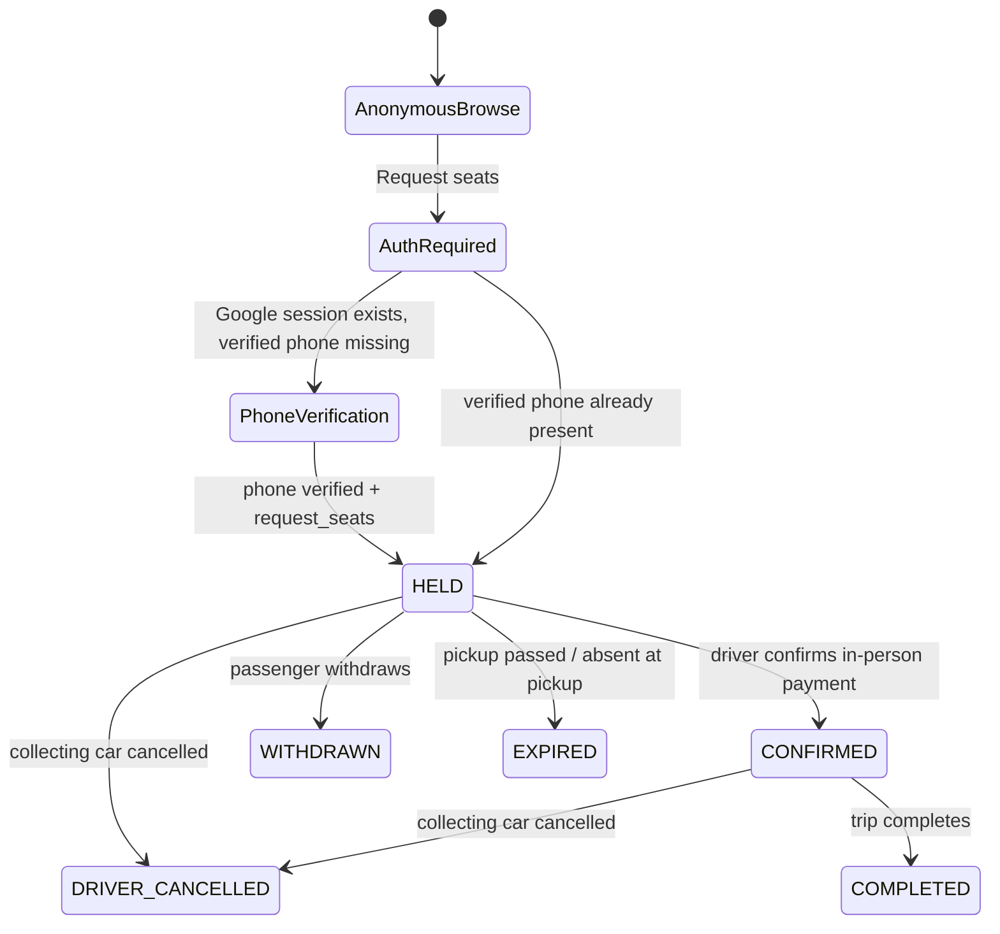
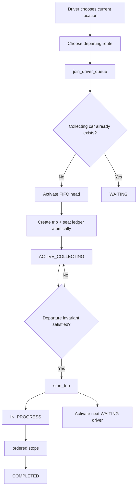
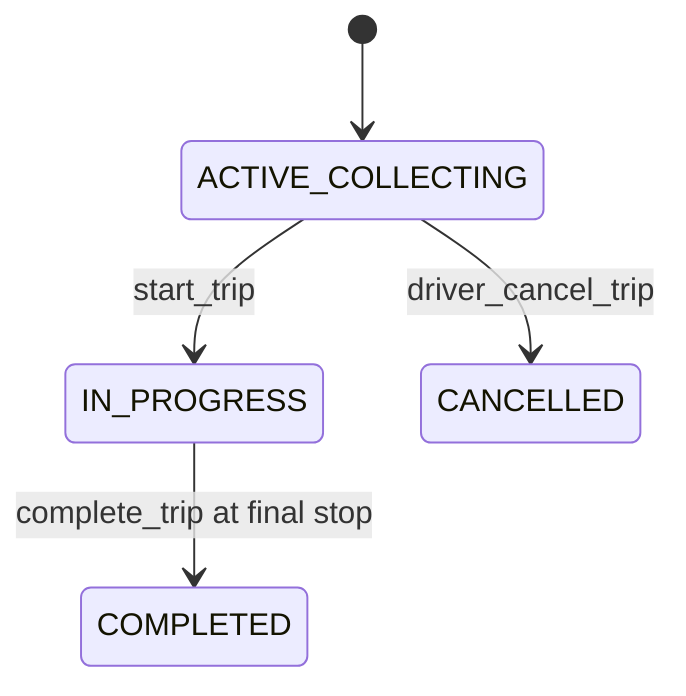
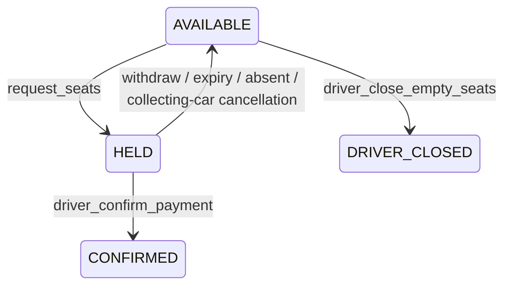
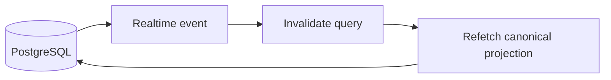

# Raahi Mini — Master Architecture Sheet

**Status:** Canonical living architecture reference  
**Authority:** This document defines intended system behaviour. Code, migrations, UI and operational procedures must conform to it.  
**Governance:** Every architecture-affecting change must update this sheet in the same PR. If implementation and this sheet disagree, stop and reconcile before proceeding.

## 1. Product definition

Raahi Mini is a shared-seat micro-transit coordination system. Public users may choose a location, discover connected routes, inspect the current collecting car, seat availability, pickup points, route progress and ETA without signing in. Authentication is required only when a passenger actually requests seats.

Passengers pay the driver directly after meeting physically. Raahi does not collect fare in V1. Reliability comes from trusted identity, verified phone for passenger booking, behaviour events, no-show/cancellation history, admin restrictions and auditable operational controls.

Drivers belong to Raahi and a vehicle, not permanently to a route. For every journey the driver selects a current location, sees only routes departing that location, selects a route and joins FIFO. After completion the destination is suggested as the next current location.

## 2. Non-negotiable architecture principles

1. PostgreSQL is the authoritative business state.
2. UI never directly mutates core operational tables.
3. Every business transition occurs through one canonical RPC/command.
4. Supabase Realtime only invalidates/refetches canonical projections; realtime payloads are not state authority.
5. `driver_queue` owns FIFO and journey-specific driver route choice.
6. `trips` owns journey lifecycle.
7. `seat_requests` owns passenger demand lifecycle.
8. `trip_seats` is the authoritative physical seat ledger.
9. Admin exceptions use explicit audited commands and preserve the same invariants as normal flows.
10. Public clients consume purpose-built projections, not authoritative operational rows.
11. Historical terminal queue records may repeat; uniqueness applies to live state only.
12. Configuration tables are client read-only. Writes require canonical audited admin commands or reviewed migrations.

## 3. Domain ownership

- `profiles`: trusted identity, one operational role, restriction state.
- `drivers`: driver operational record; no permanent route ownership.
- `vehicles`: actual vehicle and capacity (4/6/8).
- `locations`: service locations/cities.
- `routes`: directed journey from one location to another.
- `route_locations`: discovery tags connecting a route to relevant locations.
- `route_stops`: fixed ordered pickup path.
- `driver_queue`: journey-specific route choice, FIFO state and rank.
- `trips`: collecting/in-progress/completed/cancelled journey instance.
- `seat_requests`: passenger HELD/CONFIRMED/terminal request state.
- `trip_seats`: concrete AVAILABLE/HELD/CONFIRMED/DRIVER_CLOSED seat rows.
- `trip_progress`: ordered stop arrivals.
- `behaviour_events`: reliability evidence.
- `audit_logs`: immutable operational audit trail.

## 4. Location and route discovery

Browsing is public. The first discovery layer is location/city selection. Selecting a location shows all active routes associated with that location, including both routes leaving it and routes arriving there, grouped in UI as appropriate (for example “Going from Gomoh” and “Coming to Gomoh”).

Driver discovery is stricter: after choosing current location, the driver sees only active routes whose `from_location_id` equals that location. The server validates this again when `join_driver_queue` runs.

Public discovery only exposes an `ACTIVE_COLLECTING` car as the currently bookable car. An `IN_PROGRESS` car is never presented as bookable.

## 5. Strict operational role model

Every authenticated account has exactly one operational role: `passenger`, `driver`, or `admin`.

- **Passenger:** public discovery plus authenticated seat booking/status. Cannot perform driver/admin operations.
- **Driver:** route selection, FIFO queue, passenger handling and trip operations. Cannot request passenger seats.
- **Admin:** administration only. Cannot request passenger seats or operate a driver journey unless deliberately converted through a trusted administrative process.

There is no user-facing role switcher. Client metadata can never self-promote a user.

### Routing and identity clarity

- Signed-in identity displays trusted display name and role; email is available in the account menu.
- Passenger accounts remain in the passenger experience.
- Active driver accounts automatically route to the driver experience.
- Active admin accounts automatically route to `/admin-panel`.
- Passenger accounts cannot enter protected driver/admin operational routes.
- Driver accounts cannot enter passenger booking operations.
- Admin accounts cannot enter passenger/driver operational flows.

### Sign-in entry rules

- Anonymous passenger browsing has no global login requirement.
- Passenger Google authentication is initiated only when the user actually requests seats.
- Unauthenticated drivers have a dedicated **Driver sign in** entry and `/driver-login` flow.
- First-time driver candidates remain passenger-role until trusted admin onboarding.
- There is no public **Admin sign in** item in passenger navigation.
- The private `/admin-panel` URL may expose a sign-in action for an authorized admin. Successful Google authentication is still accepted only when the server-side profile already has role `admin` and is unrestricted.

## 6. Passenger lifecycle

Passenger rules:

- Supabase Auth `phone_confirmed_at`, not editable profile metadata, is the phone-verification authority.
- `request_seats` rejects non-passenger roles, restricted accounts and accounts without confirmed phone.
- A passenger cannot have more than one HELD/CONFIRMED request on the same trip.
- Multi-seat requests are all-or-nothing.
- Every HELD/CONFIRMED request owns exactly `seat_count` concrete `trip_seats` rows.
- Payment is direct to driver after physical meeting.
- CONFIRMED means the driver acknowledged payment in person.
- Passenger cannot be marked absent before the car reaches the selected pickup stop.
- Driver cancellation after confirmation preserves passenger visibility through `DRIVER_CANCELLED` and refund/rebook guidance.

## 7. Driver queue and journey lifecycle

Queue invariants:

- At most one `ACTIVE_COLLECTING` queue entry per route.
- At most one live queue entry (`WAITING` or `ACTIVE_COLLECTING`) per driver.
- Queue activation is serialized per route.
- Live queue position is dense and positive; history does not participate in live uniqueness.
- Starting one trip frees the route to activate the next collecting car while the first car is `IN_PROGRESS`.
- Admin queue remove/reorder commands serialize with normal route operations and preserve FIFO invariants.

Driver/vehicle safeguards:

- Driver must have trusted `profiles.role='driver'`, be unrestricted, have active driver record and active vehicle.
- A driver cannot join another queue while already live elsewhere or while owning an in-progress trip.
- Admin cannot reassign a driver/vehicle while that driver is queued or owns a live trip.
- An active vehicle cannot be shared by another active driver/live trip.

## 8. Trip and seat invariants

Trip lifecycle:

Seat lifecycle:

Hard invariants:

1. `AVAILABLE` and `DRIVER_CLOSED` seats have no `request_id`.
2. `HELD` and `CONFIRMED` seats have a `request_id`.
3. HELD/CONFIRMED request seat counts exactly match owned seat-ledger rows.
4. Trip `confirmed_count`, `held_count` and `driver_closed_count` mirror the ledger.
5. Cancellation/withdrawal/expiry releases exactly the seats owned by that request.
6. Departure requires `held_count = 0` and `confirmed_count + driver_closed_count = capacity`.
7. Driver may intentionally close remaining AVAILABLE seats only after HELD requests are resolved.
8. Trip completion is allowed only from `IN_PROGRESS` at the route final stop.

## 9. Fixed stop progression and ETA model

Stops are deterministic and ordered. Driver progression cannot skip or move backward through canonical RPCs. Booking is permitted only for stops not already passed. Reaching a later stop expires HELD requests for earlier missed pickups. Passenger absence can be recorded only at/after the passenger pickup stop.

Pilot assumptions remain configurable but approximately: Gomoh pickup cluster ~5 minutes total and Dhanbad pickup cluster ~15 minutes total. The UI derives ETA/progress from canonical stop progression rather than requiring GPS in V1.

## 10. Cancellation and reliability

A driver may cancel only an `ACTIVE_COLLECTING` trip. Cancellation:

- locks the trip,
- releases HELD seat rows exactly,
- moves CONFIRMED requests to `DRIVER_CANCELLED`,
- cancels the driver queue entry,
- records behaviour/audit events,
- attempts to activate the next waiting driver.

Raahi does not process money/refunds in V1 because payment is direct to the driver. Passenger receives next-car/refund guidance and may report a refund problem for admin review.

V1 reliability is evidence-first, not automatic financial punishment. Behaviour events cover request creation/withdrawal/expiry, confirmed no-show, booking confirmation, driver cancellation before/after confirmation, trip completion and refund complaints.

## 11. Canonical command and projection surface

### Public projections
- `get_active_locations()`
- routes for selected location
- `get_public_active_car(route_id)`
- active-car seat availability, pickup stops and route progress

### Passenger commands/projections
- `request_seats(trip_id, pickup_stop_id, seat_count)`
- `withdraw_seat_request(request_id)`
- `passenger_report_refund_problem(request_id)`
- my active/completed ride status
- driver-cancelled recovery status

### Driver commands/projections
- `get_driver_departing_routes(location_id)`
- `join_driver_queue(route_id, current_location_id)`
- `leave_driver_queue(route_id)`
- driver home/active-car context
- queue status/rank
- `driver_confirm_payment(request_id)`
- `driver_mark_passenger_absent(request_id)`
- ordered stop progression (`driver_arrive_at_stop` / helper)
- `driver_close_empty_seats(trip_id)`
- `start_trip(trip_id)`
- `complete_trip(trip_id)`
- `driver_cancel_trip(trip_id)`

### Admin commands/projections
- list trusted role accounts
- grant/revoke admin through audited RPCs
- onboard/update trusted driver + vehicle
- deactivate driver safely
- restrict/unrestrict users subject to live-state safeguards
- read active trips and behaviour events
- read/reorder/remove queue entries through invariant-preserving commands
- configuration changes only through canonical audited RPCs or reviewed migrations

### Internal-only helpers
FIFO activation, audit recording, behaviour recording and seat-release helpers are not executable by ordinary anonymous/authenticated clients.

## 12. Admin authority and manual-control boundary

Admin authority requires a trusted, unrestricted `profiles.role='admin'` row. Selecting a login path never grants admin authority.

Admin delegation safeguards:

1. Only an active unrestricted admin can grant/revoke admin role.
2. Only existing passenger accounts can be promoted to admin.
3. Driver accounts cannot simultaneously be admins.
4. Restricted users cannot be promoted.
5. An admin cannot remove their own admin access.
6. The final active admin cannot be removed.
7. Every grant/revoke is audited.

Admin should correct coordination failures through explicit commands, not by manually editing physical truth. Admin must not directly substitute one passenger into another request, rewrite `trip_seats`, replace a driver on an active trip by row editing, or mutate live queue/trip state outside canonical exception commands.

Restriction rules:

- Restricted admins have no admin authority.
- Admin restriction cannot target another admin.
- A queued/on-trip driver cannot be restricted until the live operation is safely resolved.

## 13. Database exposure and security boundary

- Core operational tables such as `trips`, `trip_seats` and `driver_queue` are not directly readable by anonymous/authenticated clients as a substitute for projections.
- Configuration tables used for public discovery are read-only to client roles.
- No public/authenticated client has direct INSERT/UPDATE/DELETE/TRUNCATE on public business tables.
- Public SECURITY DEFINER discovery RPCs are intentional and must expose only public projection data.
- Authenticated SECURITY DEFINER RPCs remain callable only where their bodies enforce trusted identity, ownership and/or role authorization.
- RLS and grants are defense in depth; RPC body authorization is required for privileged commands.

## 14. Realtime contract

Realtime payloads never become business state by themselves.

## 15. Production acceptance invariants

Before release confidence is claimed, repeated end-to-end tests must show all of the following without manual database correction:

1. Public browse works while signed out.
2. Passenger/driver/admin role routing is mutually exclusive and correct.
3. Driver joins valid departing route and becomes WAITING or ACTIVE_COLLECTING according to FIFO.
4. Public active car becomes visible only when collecting.
5. Passenger request allocates exact HELD seats.
6. Driver confirmation converts exact seats to CONFIRMED idempotently.
7. Withdrawal/expiry/absence release exact HELD seats.
8. Departure cannot happen with HELD seats or unaccounted capacity.
9. Closing stale seats permits departure without corrupting seat counts.
10. Starting a trip activates the next waiting car for the route when applicable.
11. Stop progression is ordered and trip completes only at final stop.
12. Driver cancellation preserves passenger recovery state and next-driver handoff.
13. Repeated journeys by the same driver/route create valid terminal history without uniqueness failures.
14. Admin overrides preserve queue/trip/seat invariants and remain auditable.
15. All invariant audit queries return zero violations after each scenario.

## 16. Architecture change governance

Every PR must state one of:

- `Master Sheet impact: none` — implementation-only change with no architecture effect.
- `Master Sheet impact: updated` — lifecycle, ownership, role, command, projection, concurrency or policy changed and this document was updated in the same PR.

Do not redesign Raahi from memory. Read this Master Architecture Sheet first, inspect current migrations/code and live database state, then make the smallest architecture-consistent change.

## 17. Consolidated changelog

### 2026-08-16
- Dynamic journey-specific driver routes replaced permanent driver-route ownership.
- Driver cancellation recovery introduced `DRIVER_CANCELLED` passenger state.
- HELD requests began owning concrete seat-ledger rows.
- Ordered pickup progression and absent-at-pickup guards were enforced.
- Trusted driver onboarding and live FIFO ranks were added.
- Independent GitHub type-check/build validation was established.

### 2026-08-17
- Dedicated driver authentication entry was added without imposing passenger login.
- Admin authentication was introduced for trusted admin accounts.
- Completion became final-stop-only and passenger completed-journey projections were separated from active journeys.
- OAuth request resumption was hardened.
- Admin safety audit identified unsafe grants and queue/admin concurrency gaps.
- Repeated driver terminal history uniqueness defect was identified and fixed in production.

### 2026-08-18 — strict roles and production hardening
- Passenger, driver and admin became mutually exclusive operational roles.
- Drivers/admins are blocked from passenger seat requests at the server boundary.
- Signed-in display name and trusted role are surfaced in account UI.
- Public Admin sign-in navigation was removed; trusted admins auto-route to Admin after authentication, with private Admin Panel sign-in entry retained for operations.
- Audited admin delegation was added with last-admin/self-removal/mixed-role safeguards.
- Direct client mutation privileges were removed from configuration and route-location tables.
- Authoritative operational-table reads were narrowed to canonical projections.
- Restricted admin authority was removed.
- Driver/vehicle reassignment during live operations was blocked.
- Admin queue overrides were serialized with live route operations.
- Repository migrations were reconciled with live Supabase production state.

---

**Canonical rule:** Code implements this design; this document defines intended design. If they disagree, stop and reconcile before proceeding.
